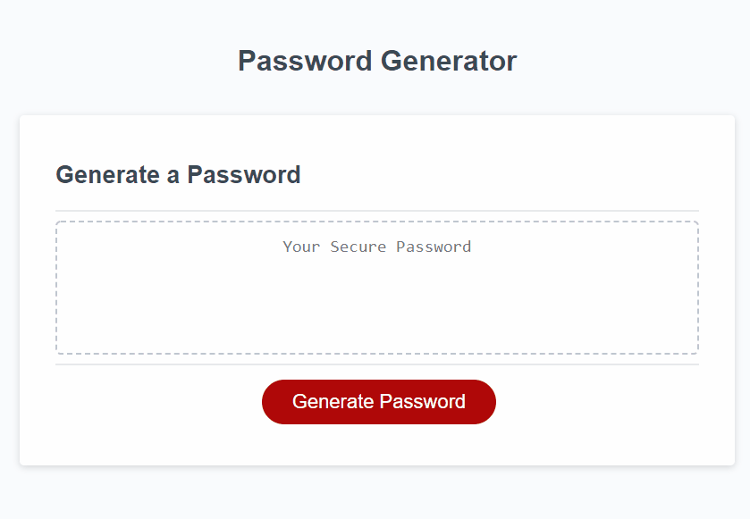

# Pass-Gen

## <ins> Table of Contents: </ins>

- [Description of the Task](#-description-of-the-task-)
- [Description of the Page](#-description-of-the-page-)
- [Remarks](#-remarks-)
- [Thought Process](#-thought-process-)
- [Learning Points](#-learning-points-)
- [Technologies and Programs Used](#-technologies-and-programs-used-)
- [Installation](#-installation-)
- [Site Demonstration](#-site-demonstration-)
- [Credits](#-credits-)

## <ins> Description of the Task: </ins>

The task that was given was to create a Javascript program to generate a random password based on certain criterias set by prompts and confirms that the user has to input without encountering any issues.  

## <ins> Description of the Page: </ins>

This page is constructed with HTML, CSS, and Javascript and it features a Javascript program that upon pressing the "Generate Password" button, the user will be asked to input a prompt for inputting the desired random password's length and if they would like certain characters included or excluded. Who would this program be suited for? This program is available for interested parties who are looking for boosting their security measures by having an extremely intricate password that is almost impossible to hack. 

## <ins> Remarks: </ins>

- The page name is meant to be a pun for keygen.
- I have added numerous comments along the Javascript files to annotate what a specific part of the code does.

## <ins> Thought Process: </ins>

1. Create a prompt that checks if the user inputs a value within a set parameters and records that value.
2. Create a set of confirm requests that ask if the user would like to have specific characters included inthe randomly generated password.
3. Create a function that would tie together the confirmed boolean inputs for desired characters and the strings for the respective desired characters.
4. Filter out any falsy boolean values in the array and combine the array into one big string.
5. Create a function to randomly generate a password using the big string array.
6. Create a function to organize all the functions together into one linear function and log out the password on the webpage.
7. Debug any possible errors and reset the variable that is used to display the randomly generated password so it can be used multiple times without having to reset the webpage.

## <ins> Learning Points: </ins>

- Learned the fundamentals of Javascript.
- Learned how Javascript ties together with HTML and CSS to create a dynamic webpage.
- Learned to break required criterias into small functions to easily understand and work step by step for the code.
- Learned to organize and consolidate code to easily be modular.
- Learned how to read errors and debug in the Javascript code using methods such as ***console.log().***

## <ins> Technologies and Programs Used: </ins>

- HTML
- CSS
- Javascript
- VS Code
- Git/Github
- Chrome Web Developer Tools

## <ins> Installation: </ins>

Installation is not required for this for it is a mainly a Javascript program that can be run right from the website.

## <ins> Site Demonstration: </ins>

## <ins> Credits and License: </ins>

- [Pass-gen Github Deployed Website](https://sfzmango.github.io/Pass-gen/)
- [Maung Htike](https://github.com/Sfzmango)

MIT License

Copyright (c) 2022 Maung Htike

Permission is hereby granted, free of charge, to any person obtaining a copy
of this software and associated documentation files (the "Software"), to deal
in the Software without restriction, including without limitation the rights
to use, copy, modify, merge, publish, distribute, sublicense, and/or sell
copies of the Software, and to permit persons to whom the Software is
furnished to do so, subject to the following conditions:

The above copyright notice and this permission notice shall be included in all
copies or substantial portions of the Software.

THE SOFTWARE IS PROVIDED "AS IS", WITHOUT WARRANTY OF ANY KIND, EXPRESS OR
IMPLIED, INCLUDING BUT NOT LIMITED TO THE WARRANTIES OF MERCHANTABILITY,
FITNESS FOR A PARTICULAR PURPOSE AND NONINFRINGEMENT. IN NO EVENT SHALL THE
AUTHORS OR COPYRIGHT HOLDERS BE LIABLE FOR ANY CLAIM, DAMAGES OR OTHER
LIABILITY, WHETHER IN AN ACTION OF CONTRACT, TORT OR OTHERWISE, ARISING FROM,
OUT OF OR IN CONNECTION WITH THE SOFTWARE OR THE USE OR OTHER DEALINGS IN THE
SOFTWARE.

